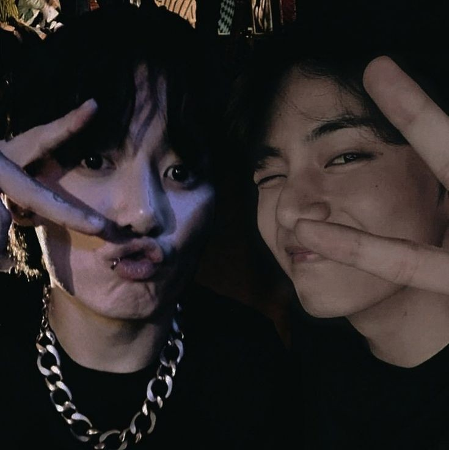

git remoto adicionar origem https://github.com/Coelho7kook/Kamille-minha-esposa-.git
 git branch -M main 
git push -u origin main

<!DOCTYPE html>
<html lang="pt-BR">
<head>
    <meta charset="UTF-8">
    <meta name="viewport" content="width=device-width, initial-scale=1.0">
    <title>Feliz Dia dos Namorados, Kamille!</title>
    
    
</head>
<body>
    <video id="background-video" autoplay muted loop>
        <source src="background.mp4" type="video/mp4">
        Seu navegador não suporta a tag de vídeo.
    </video>
    

        <h1>Feliz Dia dos Namorados, Kamille!</h1>
        
Você é minha inspiração e meu desejo. Clique nos botões abaixo para descobrir algo especial.

        
        <button onclick="showContent('frase1', 'audio1')">
            
        </button>
        <button onclick="showContent('frase2', 'audio2')">
            
        </button>
        <button onclick="showContent('poema1', 'audio3')">
            
        </button>
        <button onclick="showContent('poema2', 'audio4')">
            
        </button>
        <button onclick="showContent('poema3', 'audio5')">
            
        </button>
        <button onclick="showContent('poema4', 'audio6')">
            
        </button>
        <button onclick="showContent('poema5', 'audio7')">
            
        </button>
        <button onclick="showContent('poema6', 'audio8')">
            
        </button>
        <button onclick="showContent('poema7', 'audio9')">
            
        </button>
        <button onclick="showContent('poema8', 'audio10')">
            
        </button>

        <audio id="audio1" src="musica1.mp3"></audio>
        <audio id="audio2" src="musica2.mp3"></audio>
        <audio id="audio3" src="musica3.mp3"></audio>
        <audio id="audio4" src="musica4.mp3"></audio>
        <audio id="audio5" src="musica5.mp3"></audio>
        <audio id="audio6" src="musica6.mp3"></audio>
        <audio id="audio7" src="musica7.mp3"></audio>
        <audio id="audio8" src="musica8.mp3"></audio>
        <audio id="audio9" src="musica9.mp3"></audio>
        <audio id="audio10" src="musica10.mp3"></audio>

        

            
"A cada dia que passa, meu amor por você só aumenta. Feliz Dia dos Namorados, minha eterna paixão."

        

        

            
"Seu sorriso ilumina meu mundo. Te amo mais do que palavras podem expressar. Feliz Dia dos Namorados, meu amor."

        

        

            
Te envolver em meus braços, sentir seu corpo se arrepiar, 
            Beijar seu pescoço, ouvir seus suspiros, gemidos de prazer. 
            O toque suave que faz sua pele estremecer, 
            Nosso amor é intenso, um êxtase a cada amanhecer.

        

        

            
Amarrarei suas mãos com delicadeza, 
            Seus olhos vendados, sua respiração acelerada. 
            Sentir seu corpo se contorcer, a expectativa no ar, 
            Nossos desejos se encontram, puro prazer e sedução.

        

        

            
Seu gemido suave me deixa em êxtase, 
            O sabor da sua pele, um convite ao desejo. 
            Beijos no pescoço, arrepios que causam prazer, 
            Nosso amor é uma dança, uma sinfonia de gemidos.

        

        

            
Te amarrar na cama, ver seu corpo se entregar, 
            Seus suspiros e gemidos, um balé de emoção. 
            Sentir cada arrepio, cada desejo realizado, 
            Nosso amor é um jogo de prazer e paixão.

        

        

            
Minha língua desliza suavemente pelo seu pescoço, 
            Cada toque causando arrepios de prazer. 
            Seus gemidos são a melodia que guia nossos movimentos, 
            Uma dança de corpos entrelaçados e desejos ardentes.

        

        

            
Minhas mãos exploram cada centímetro do seu corpo, 
            Sentindo a suavidade da sua pele. 
            Seus olhos fechados em expectativa, 
            Cada beijo, cada toque, levando-nos ao êxtase.

        

        

            
Seu corpo é meu templo, onde adoro cada detalhe, 
            Beijando, mordiscando, explorando sem pressa. 
            Seus suspiros e gemidos me guiam, 
            Uma sinfonia de prazer e paixão.

        

        

            
No calor da nossa entrega, nos perdemos na dor e no prazer, 
            O toque suave da luxúria se mistura com o ardor do sofrer. 
            Amarro suas mãos com a seda da submissão, 
            Seus olhos brilham com a excitação da rendição.

            
            
Sussurro promessas de êxtase e de dor, 
            Cada chicoteada é um gemido de desejo, um clamor. 
            Seu corpo se contorce sob meu comando, 
            Cada marca, uma marcação de um amor profundo e insano.

            
            
O prazer se entrelaça com a dor em nossa dança, 
            E o masoquismo se torna a nossa liberdade, nossa esperança. 
            Nossos corpos em harmonia, em um frenesi de paixão, 
            Até encontrarmos a calmaria após a intensa tempestade da nossa união.

            
            
Em cada suspiro, em cada toque, somos dois em um só ser, 
            Uma simbiose de desejos que nos faz transcender. 
            A entrega completa, sem reservas, sem medo, 
            Num amor que se define pela intensidade do nosso enredo.

            
            
Cada enlace é uma dança cósmica de emoção, 
            Onde o prazer se entrelaça com a dor em perfeita comunhão. 
            Cada instante é eternizado pelo fogo que nos consome, 
            Até que o êxtase se transforme em calma e nossos corpos se tornem um só nome.

        

    

</body>
</html>
